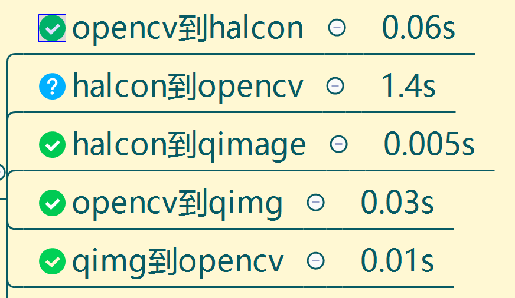

# 1 qt_halcon_cv_convert
data convert between halcon,qt,opencv,using C++


# 2 a succesefull convert projects
# 3 inviroments
```
halcon20.11
opencv4.5.1
qt5.15.2 MSVC2019

amd2700
gtx1650
32GB 3000 ddr4
```

# 4:results

